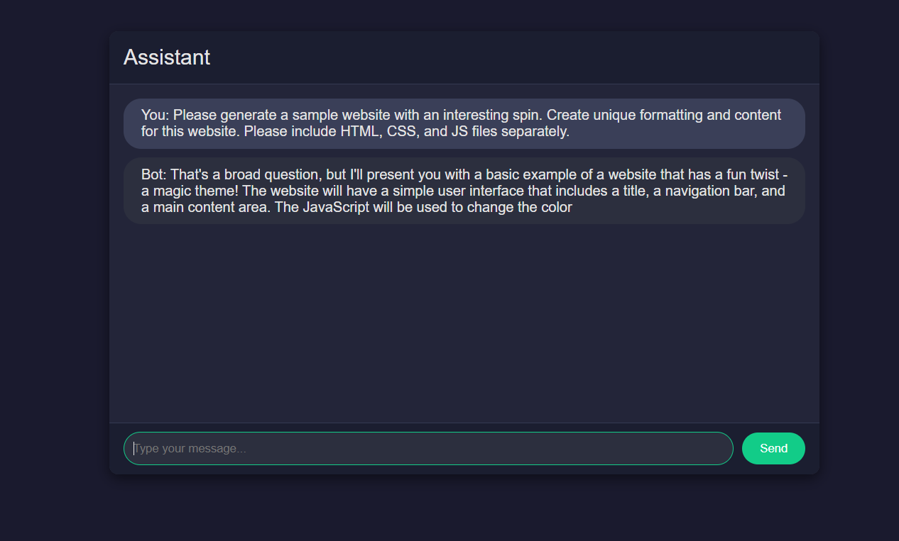

Using OpenAI's GPT API and creating my own chat interface allows for nice customizations. As LLM capabilities increase (I am looking very excitedly at [Phind](pind.com), which boasts to [beat GPT-4 at coding with GPT-3.5's speed](https://news.ycombinator.com/item?id=38088538)), I hope to move away from the OpenAI GPT-4 API, but for now it is the current state-of-the-art in this new fascinating field.

Using the Markdown converter [Showdown](https://github.com/showdownjs/showdown), I am able to output markdown and HTML formatting that the model can produce.
It was very simple to use: just plug it in and it worked to start converting text.
Though, noticably, there is an issue when plainly using Showdown: Showdown doesn't sanitize the input (by design)

This was immediately noticeable when using the model to generate text. [image below] It was capable of injecting its own HTML and scripts into the website.

